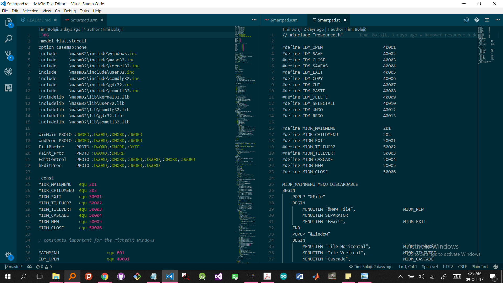
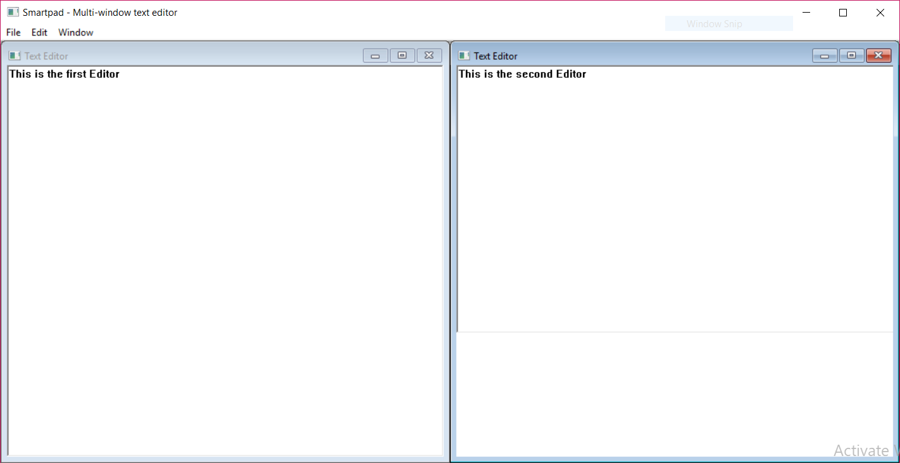

# Basic MASM Text Editor
The aim is to create a text editor based on IcZelion's MASM tutorials, building on the Rich Text incrementally adding functionality to the package.

## Assembling the package
Simply run (double-click) [makeit.bat](makeit.bat), to assemble the package automatically. Then, you can run either the basic edition by opening "texteditor.exe", or the advanced MDI version by opening "Smartpad.exe". Please note that to assemble using the above method, you must have the masm32 libraries and assembler installed, preferably at the default location (C:/masm32/...).

## Features
The current iteration includes a basic text editor, with the following functionality implemented:
* Open/Save
* Select all
* Undo/Redo
* Copy/Paste

### Advanced Editor
This was inspired by the ability of source code editors to split the window and simultaneously view/edit multiple files as shown in the screenshot below

Taking advantage of the multiple document interface (MDI), in conjunction with the RichTextEdit control, we were able to create multiple editors in one parent window. This enables a user to be able to open two documents and work on them side-by-side.

The final output is:
